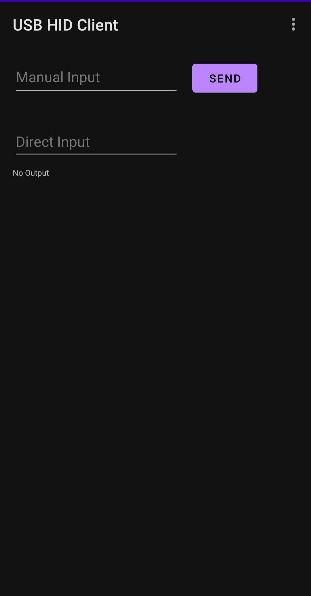
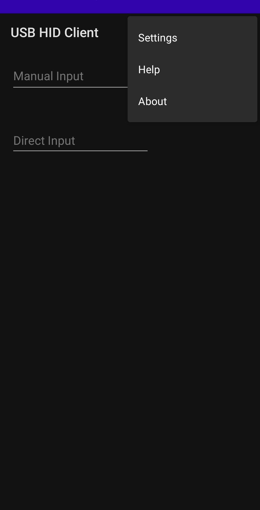

<div id="top"></div>
<!--
*** Thanks for checking out the Best-README-Template. If you have a suggestion
*** that would make this better, please fork the repo and create a pull request
*** or simply open an issue with the tag "enhancement".
*** Don't forget to give the project a star!
*** Thanks again! Now go create something AMAZING! :D
-->


<!-- PROJECT SHIELDS -->
<!--
*** I'm using markdown "reference style" links for readability.
*** Reference links are enclosed in brackets [ ] instead of parentheses ( ).
*** See the bottom of this document for the declaration of the reference variables
*** for contributors-url, forks-url, etc. This is an optional, concise syntax you may use.
*** https://www.markdownguide.org/basic-syntax/#reference-style-links
-->
[![Contributors][contributors-shield]][contributors-url]
[![Forks][forks-shield]][forks-url]
[![Stargazers][stars-shield]][stars-url]
[![Issues][issues-shield]][issues-url]
[![GPL-3.0 License][license-shield]][license-url]

<!-- PROJECT LOGO -->
<br />
<div align="center">
  <a href="https://github.com/Arian04/android-hid-client">
    
  </a>

<h3 align="center">USB HID Client</h3>

  <p align="center">
    Android app that allows you to easily use your phone as a keyboard
    <br />
    <a href="https://github.com/Arian04/android-hid-client/wiki"><strong>Explore the docs »</strong></a>
    <br />
    <br />
    <a href="https://github.com/Arian04/android-hid-client/issues">Report Bug</a>
    ·
    <a href="https://github.com/Arian04/android-hid-client/issues">Request Feature</a>
  </p>
</div>


<!-- TABLE OF CONTENTS -->
<details>
  <summary>Table of Contents</summary>
  <ol>
    <li>
      <a href="#about-the-project">About The Project</a>
    </li>
    <li>
      <a href="#getting-started">Getting Started</a>
      <ul>
        <li><a href="#prerequisites">Prerequisites</a></li>
      </ul>
    </li>
    <li><a href="#usage">Usage</a></li>
    <li><a href="#roadmap">Roadmap</a></li>
    <li><a href="#contributing">Contributing</a></li>
    <li><a href="#license">License</a></li>
    <li><a href="#acknowledgments">Acknowledgments</a></li>
  </ol>
</details>


<!-- ABOUT THE PROJECT -->
## About The Project

[](images/app-screenshot.png)
[](images/app-screenshot2.png)

*UI subject to change since app isn't stable yet*

This Android app allows you to use your phone as a keyboard by communicating with `/dev/hidg0`, a
character device that allows your phone to send keys to a connected host device. It presents itself
as a standard hardware input device and therefore doesn't require any additional software to be
installed on the computer. It is also completely functional within the connected computer's
BIOS/UEFI. This app supports most standard keyboard keys, including a-z, 0-9, \`~!
@#$%^&*()_+{}|:"><,.;'[]\=-, function keys, SysRq/Print Screen, and several more (I strongly
recommend using [Hacker's Keyboard](https://github.com/klausw/hackerskeyboard) to use special keys
such as modifier and function keys).

Disclaimer: This app requires your device to be rooted.

Tested primarily on: Linux (Host computer) and Pixel 5 running Android 12.

<p align="right">(<a href="#top">back to top</a>)</p>


<!-- GETTING STARTED -->

## Getting Started

### Prerequisites

* Rooted device running Android
  - The only supported root method is magisk (this is because `magiskpolicy` is used)
  - Technically supported Android versions: 10 - 12
  - Tested Android versions: 12
* Soft Keyboard
	- I test the app with Gboard and Hacker's keyboard, but Hacker's keyboard is the one with better support, more keys, and [less issues](https://github.com/Arian04/android-hid-client/issues?q=label%3A%22soft+keyboard+issue%22+is%3Aclosed).
	- Important Hacker's Keyboard settings to change: 
		- `Key behavior settings > Ctrl key code = None (Ignored when not modifying other keys)`
		- `Key behavior settings > Alt key code = None (Ignored when not modifying other keys)`
		- `Key behavior settings > Meta key code = None (Ignored when not modifying other keys)`

### Installation (Source)<a name="installation-source"></a>

Clone the repository.

   ```sh
   git clone https://github.com/Arian04/android-hid-client.git
   ```

import into [Android Studio](https://developer.android.com/studio), build the APK, then install it
on your Android device.

### Installation (Binary)<a name="installation-binary"> </a>

Download the APK file from
the [Github releases page](https://github.com/Arian04/android-hid-client/releases), then install it
on your Android device

<p align="right">(<a href="#top">back to top</a>)</p>


<!-- USAGE EXAMPLES -->

## Usage

Typing in the "Direct Input" text box will immediately relay the keys that you press to the
connected device. The keys will not be displayed in the text box as you type them.

Typing in the "Manual Input" text box will send all the characters that you've typed into the box to
the connected device once you hit the "send" button.

### Some Use Cases

* Quickly be able to change BIOS/UEFI settings of a computer when you don't have a keyboard with you
* Typing a long string (such as a password or IP address) into a console

<p align="right">(<a href="#top">back to top</a>)</p>


<!-- ROADMAP -->

## Roadmap

- [X] Keyboard support
- [ ] Add some special key buttons to the UI (like multimedia keys)
- [ ] Touchpad support
- [X] Ability to send string all at once
- [X] Add full settings page
- [X] Add prompt to create /dev/hidgX if not present

See the [open issues](https://github.com/Arian04/android-hid-client/issues) for a full list of proposed features (and known issues).

<p align="right">(<a href="#top">back to top</a>)</p>


<!-- CONTRIBUTING -->
## Contributing

Contributions are what make the open source community such an amazing place to learn, inspire, and create. Any contributions you make are **greatly appreciated**.

If you have a suggestion that would make this better, please fork the repo and create a pull request. You can also simply open an issue with the tag "enhancement".
Don't forget to give the project a star! Thanks again!

1. Fork the Project
2. Create your Feature Branch (`git checkout -b feature/AmazingFeature`)
3. Commit your Changes (`git commit -m 'Add some AmazingFeature'`)
4. Push to the Branch (`git push origin feature/AmazingFeature`)
5. Open a Pull Request

<p align="right">(<a href="#top">back to top</a>)</p>


<!-- LICENSE -->
## License

Distributed under the GNU GPLv3 License. See `LICENSE.txt` for more information.

<p align="right">(<a href="#top">back to top</a>)</p>


<!-- ACKNOWLEDGMENTS -->
## Acknowledgments

* [Best-README-Template](https://github.com/othneildrew/Best-README-Template)

<p align="right">(<a href="#top">back to top</a>)</p>


<!-- MARKDOWN LINKS & IMAGES -->
<!-- https://www.markdownguide.org/basic-syntax/#reference-style-links -->
[contributors-shield]: https://img.shields.io/github/contributors/Arian04/android-hid-client.svg?style=for-the-badge
[contributors-url]: https://github.com/Arian04/android-hid-client/graphs/contributors
[forks-shield]: https://img.shields.io/github/forks/Arian04/android-hid-client.svg?style=for-the-badge
[forks-url]: https://github.com/Arian04/android-hid-client/network/members
[stars-shield]: https://img.shields.io/github/stars/Arian04/android-hid-client.svg?style=for-the-badge
[stars-url]: https://github.com/Arian04/android-hid-client/stargazers
[issues-shield]: https://img.shields.io/github/issues/Arian04/android-hid-client.svg?style=for-the-badge
[issues-url]: https://github.com/Arian04/android-hid-client/issues
[license-shield]: https://img.shields.io/github/license/Arian04/android-hid-client.svg?style=for-the-badge

[license-url]: https://github.com/Arian04/android-hid-client/blob/master/LICENSE.txt

[product-screenshot]: images/app-screenshot.png
